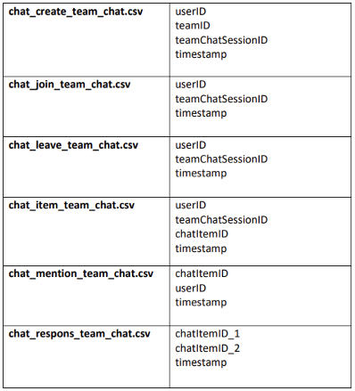

## Graph Analytics With Chat Data Using Neo4j

#### 📚 Overview:

- This project leverages **Neo4j**, a powerful graph database, to analyze chat data. It enables insights into user interactions, message patterns, and network dynamics by visualizing relationships and running graph-based queries.

#### Danh sách thành viên Team Chill guy:

- Nguyễn Tuấn Thành - 220222624.
- Nguyễn Công Thành - 22022623.
- Vũ Đình Thọ - 22022580.
- Đinh Văn Sinh - 22022615.
- Nguyễn Mạnh Hùng - 22022623.

#### 🗂 Project Structure:

```
├── data/                   # Raw chat data files (CSV)
├── Neo4j/                  # Cypher query templates
├── docs                    # Images for README.md
├── README.md               # Project documentation (this file)
├── report.pdf              # Repost
└── Link Slide              # Link slide
```

## 🛠 Features:

- **Data Ingestion**: Import chat data (e.g., users, messages, timestamps) into a Neo4j database.
- **Graph Modeling**: Represent chats as a graph with nodes (e.g., Users, Messages, Rooms) and relationships (e.g., SENT, RECEIVED, BELONGS_TO).
- **Advanced Queries**: Run Cypher queries to uncover insights such as:
  - Most active users.
  - Popular chat rooms.
  - Keyword-based message analysis.
  - Community detection.
- **Visualization**: Use Neo4j Browser or external tools to visualize chat networks.

#### Data Structure:



## 📧 Contact

For questions or support, please email **tuanthanh2kk4@gmail.com** or create an issue in the repository.


